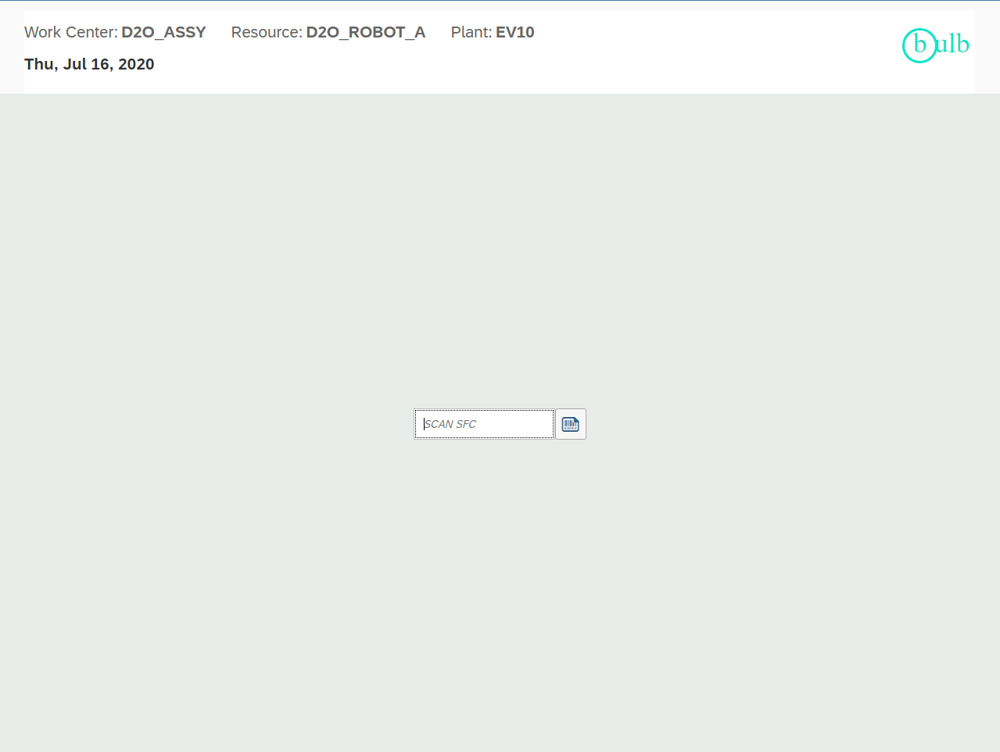
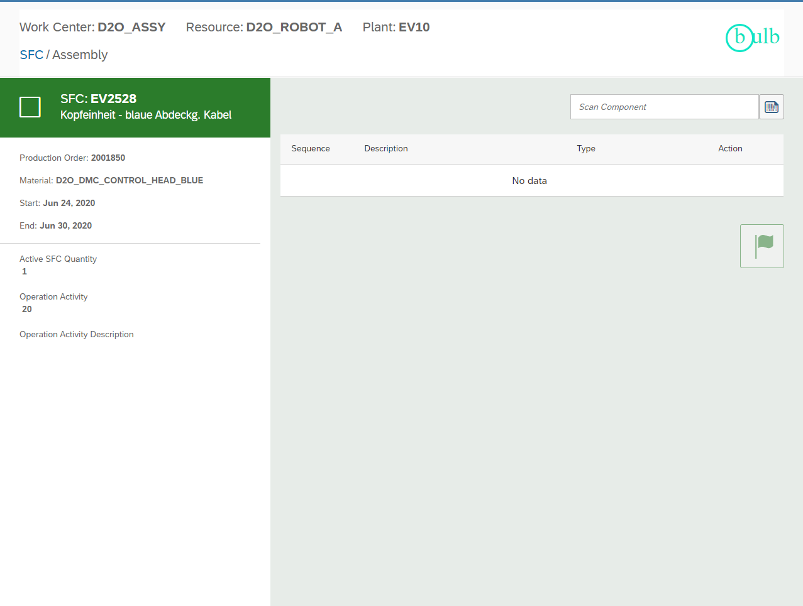
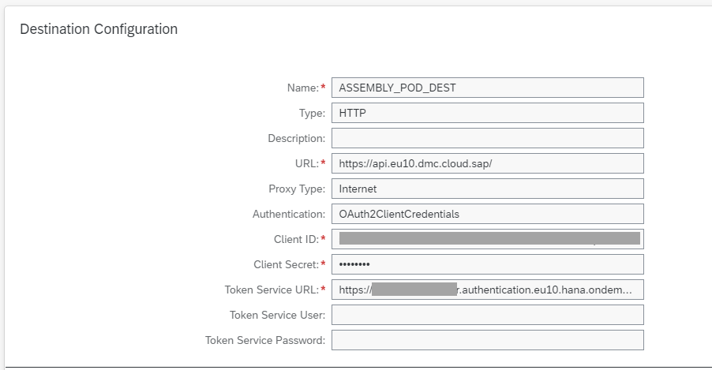
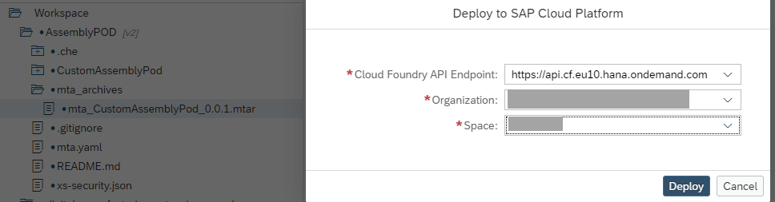
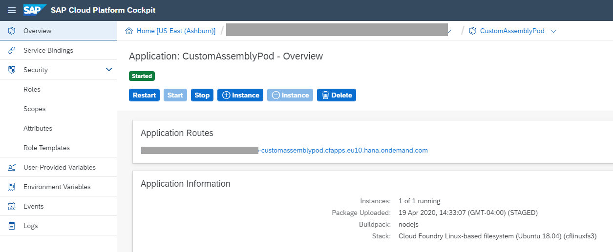

Steps to Deploy and Use the Application

1. Clone the application repository from the Git source.

2. Build the mta.yaml file using one of the following methods:

         mbt build or

         Right-click the project in your IDE and select: "Build MTA Project" This process generates a .mtar file.

3. Deploy the generated .mtar file to your Cloud Foundry space.

4. Post-Deployment Configuration

      a. Update xs-security.json  After deployment:

            Copy the deployed application's URL.

            Add the following section after roles-template in xs-security.json:
   
                      "oauth2-configuration": {
                           "redirect-uris": [
                                 "<Deployed-Application-URL>/**"
                               ]
                           }

                 Example URL:  https://4a13cd20trial-dev-customassemblypod.cfapps.us10-001.hana.ondemand.com

       b. Configure Destination in BTP Trial Account

             Open xs-app.json and locate the destination field. Create a destination in your BTP Trial account that matches the name exactly.

             Destination Details:

                   Name: ASSEMBLY_POD_DEST (can be customized, but must match xs-app.json)

                   Type: HTTP

                   Authentication: OAuth2ClientCredentials

                   Client ID: [Provided in service key]

                   Client Secret: [Provided in service key]

                   Proxy Type: Internet

                   URL: Public API Endpoint

                  Token Service URL: <Service-URL>/oauth/token

                  Additional Property:

                        Key: HTML5.DynamicDestination

                        Value: true

                  Note: You can find the client credentials in your RITS DMC subaccount under Instances and Subscriptions > [Your Instance] > Service Key of SAP DMC Execution.

5. Prepare Application Launch URL

       Create the final URL in this format:  <Deployed Application URL>/<welcomeFile from xs-app.json>?WORK_CENTER=<Work Center>&RESOURCE=<Resource>&PLANT=<Plant>

       Example:  https://4a13cd20trial-dev-customassemblypod.cfapps.us10-001.hana.ondemand.com/ui/index.html?WORK_CENTER=MOBILE-WC1&RESOURCE=MOBILE-R1&PLANT=MB01

       Open this URL in a new browser tab to launch the application.

6. Use the Application

     Enter the SFC and press Enter.

     If the SFC is not started, it will start automatically and navigate to the Assembly screen.

     In the scan input field, enter the component to be assembled.

     Once all components are scanned, the Flag button will become active.

     Click the Flag to complete the SFC.

        ⚠️ Note: If you're unable to complete the SFC, it might be due to user restrictions.To fix this, go to the Manage Resources app in DMC and enable the Process Resource option for your user. Then, retry              completing the SFC.

# AssemblyPOD

The Assembly Template POD is a UI5 application designed to allow assembly operations for a single SFC
at an active operation step. It utilizes public APIs published to the Public API Hub for accessing
microservices in SAP Digital Manufacturing Cloud for execution. Customers and partners can import the
Assembly Template POD into Web IDE, make modifications as needed, and deploy it to their PaaS
account. 

# Pre-requisites
1. SAP Cloud Platform Account
2. SAP Cloud Platform subaccount Entitlement for Application Runtime
3. SAP Cloud Platform subaccount Entitlement for Destination

#### Template Assembly POD Landing Page

#### Template Assembly POD Detail Page

# Getting Started

Please check [SAP Help Portal - Digital Manufacturing Cloud](https://help.sap.com/viewer/product/SAP_DIGITAL_MANUFACTURING_CLOUD/latest/en-US "SAP Help Portal - Digital Manufacturing Cloud") for general information.

The major steps are:
#### 1. Prepare your Editor  
Clone the repository to your editor and build the application. SAP WebIDE provides easy build and deploy capability to SCP but this can be achieved with local editors as well. 
#### 2. Configure the Destination 
Create a destination in the SAP Cloud Platform tenant, please refer the following screenshot for sample values. 
- ***Destination*** : It should match with the name given in xs-app.json file. 
- ***URL*** : It can be found in the endpoint of SAP API Business Hub. For DMC Production instance, it should be `https://api.[region].dmc.cloud.sap`. For DMC Quality instance, it should be `https://api.test.[region].dmc.cloud.sap`. The list of available URLs can be found in the SAP API Business Hub. 
- ***Client ID*** : It can be fetched from the value of "clientid" in the service key of Digital Manufacturing Cloud instance in your SAP Cloud Platform Account.
- ***Client Secret*** : It can be fetched from the value of "clientsecret" in the service key of Digital Manufacturing Cloud instance in your SAP Cloud Platform Account.
- ***Token Service URL*** : It can be fetched from the value of "url" in the service key of Digital Manufacturing Cloud instance in your SAP Cloud Platform Account, and add "/oauth/token" in the end. For example, `https://[subaccount].authentication.[region].hana.ondemand.com/oauth/token`.

#### 3. Deploy to your SAP Cloud Platform Tenant
After building the application the MTAR file will be available in the mta_archieves folder which can be deployed to SAP Cloud Platform.

#### 4. Run the Application with the URL parameters
Build the application url adding the appropriate URL parameters
https://<APP_URL>?WORK_CENTER=<>&RESOURCE=<>&PLANT=<>.
  
# 2D Barcodes for Assembling Components

The Assembly page provides an input field for scanning ISO 15434 barcodes. There are issues with
scanning ISO 15434 barcodes with several major browsers that cause browser shortcut keys to be
invoked. For that reason, the following control character sequences should be used by barcodes used by
the Assembly Template POD.

| Code Type      | Control Character      | Replacement Control Characters |
| -------------- | ---------------------- | ------------------------------ | 
| Group Separator | <GS> ASC 29 | {GS} |
| Record Separator | <RS> ASC 30 | {RS} |
| End of Transmission | <EOT> ASC 4 | {EOT} |
  
Additional scan codes that must be included are defined below.

| Code Type      | Control Characters      | 
| -------------- | ---------------------- | 
| Scan Header  |   |
| Data Format | 06 |

The following data types are supported using the ISO 15434 types defined below

| Data Type      | Prefixes      | 
| -------------- | ---------------------- | 
| COMPONENT  | 19P |
| SERIAL_NUMBER | 15S, 18S, 2C, S, 1S |
| LOT_NUMBER | T, 1T|
| COMMENTS | 11Z, 12Z, 13Z |
| SFC | 1FC |
| INVENTORY_ID_SFC | 1IS |

The scan must include the header of “” as well as the data format “06” to be interpreted properly.
See example barcode below:
06{GS}11ZComment Test{GS}19PBRACKET{GS}T002_LOT{GS}15S1234-ES{RS}{EOT}
Will return the following information:

COMPONENT: BRACKET
COMMENT: Comment Test
LOT_NUMBER: 002_LOT
SERIAL_NUMBER: 1234-ES

The COMPONENT data field is required in the Assembly Template POD. If it is not provided an error will display.

## How to obtain support
If you have issues with this sample, please open a report using [GitHub issues](../../../../../issues).

## License
Copyright © 2020 SAP SE or an SAP affiliate company. All rights reserved.
This file is licensed under the SAP Sample Code License except as noted otherwise in the [LICENSE file](../../../LICENSE).
